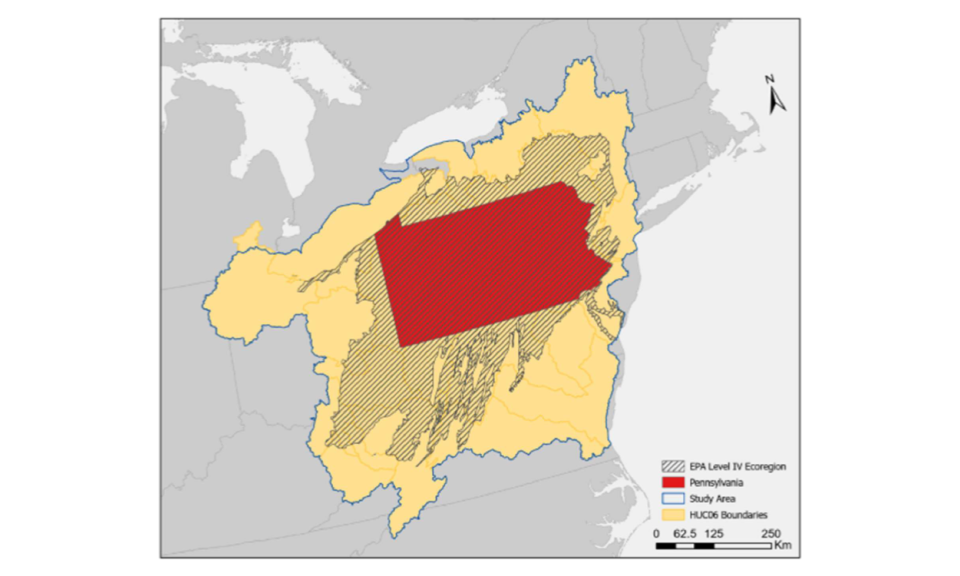
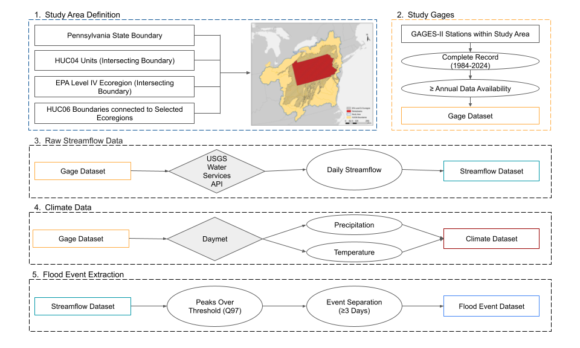
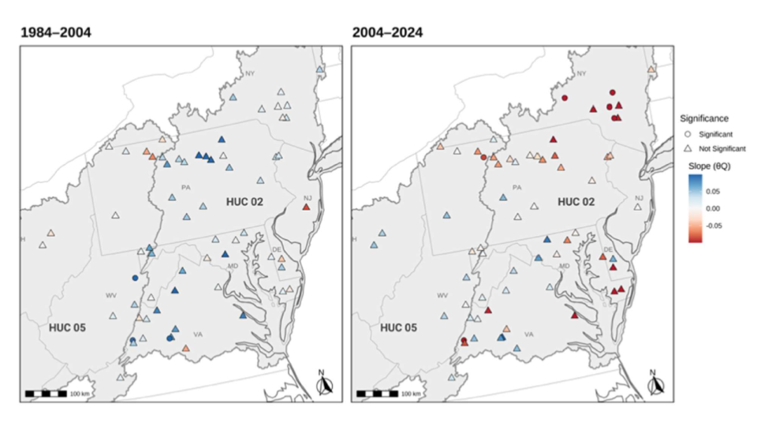

## Temporal Analysis of Flood Timing and Seasonality

*Hydrology · GIS Workflow Design · Climate Data Integration*

This project examined how flood timing and seasonal behavior have shifted across Mid-Atlantic watersheds over multiple decades. It combined long-term streamflow records, climate data, and spatial analysis into a reproducible workflow designed to identify emerging hydrologic patterns relevant to planning, forecasting, and watershed understanding.

::: {.callout-note appearance="simple"}
### Why this project stands out
This work reflects the kind of geospatial problem-solving I am most interested in: integrating environmental datasets, structuring a clear analytical workflow, and communicating regional spatial patterns in a way that supports real-world interpretation.
:::

## Study Context

{fig-align="center" width="72%"}

The analysis focused on a regional network of watersheds spanning major Mid-Atlantic river basins. This broader study extent made it possible to compare flood timing behavior across diverse physiographic and hydrologic settings.

## Workflow Design

{fig-align="center" width="88%"}

The project was built as a multi-stage workflow linking streamflow records, climate variables, and watershed context into a unified analytical pipeline. The emphasis was on reproducibility, consistency across monitoring sites, and spatial comparability.

Key components included:

- geospatial data integration for streamflow and climate inputs  
- event-based hydrologic analysis for identifying high-flow periods  
- cyclical and seasonal analysis for timing behavior  
- trend evaluation to assess long-term hydrologic change  

## Key Patterns

{fig-align="center" width="74%"}

The results suggested a shift toward later and more variable flood timing across parts of the region, along with increased evidence of multimodal seasonal behavior. Patterns also pointed to a stronger warm-season precipitation influence in some watersheds, suggesting evolving flood-generating processes over time.

## Methods and Tools

::: {.columns}
::: {.column width="50%"}
**GIS and data tools**

ArcGIS Pro  
R  
Environmental data pipelines  
Spatial data integration
:::

::: {.column width="50%"}
**Analytical focus**

Spatial-temporal analysis  
Hydrologic event analysis  
Statistical modeling  
Climate-hydrology interpretation
:::
:::

## Why It Matters

This work demonstrates how GIS can support more than visualization alone. By linking spatial data management, temporal analysis, and environmental interpretation, the workflow reveals subtle changes in watershed behavior that matter for planning, risk assessment, and water resource management.